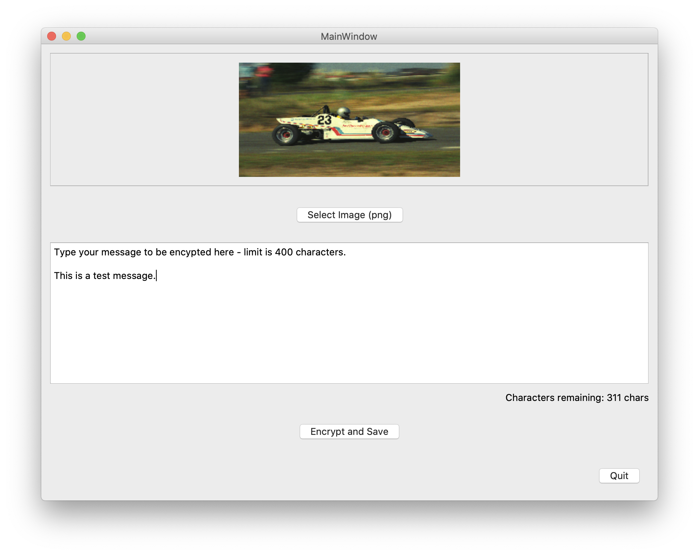
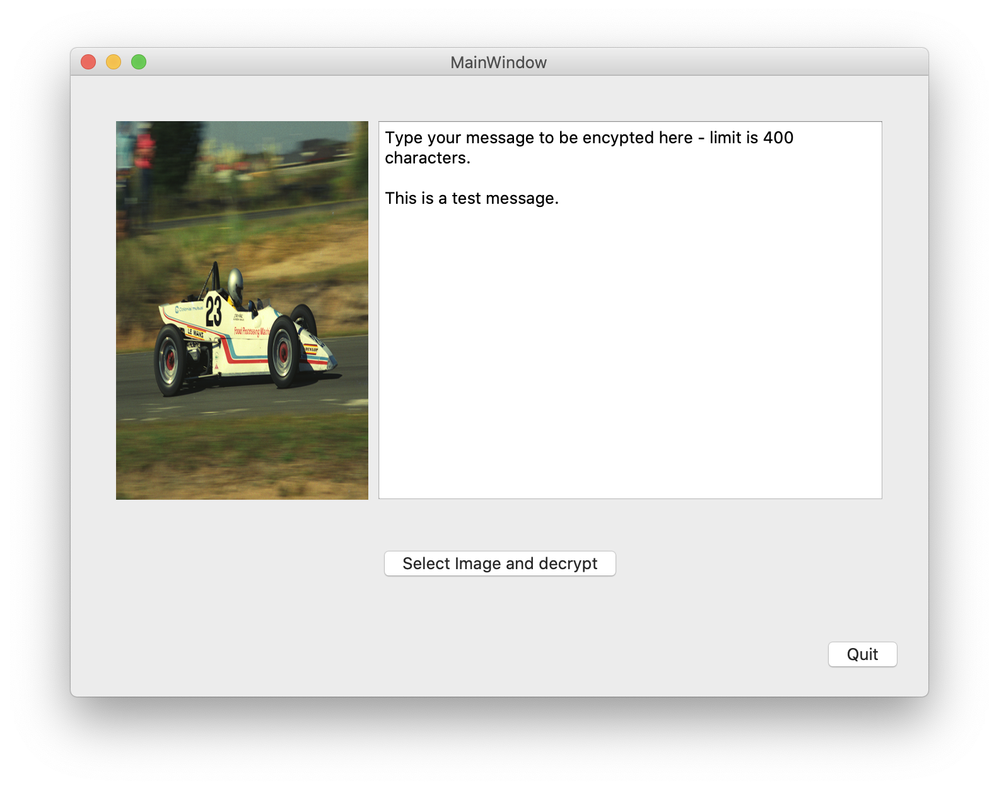

# encryption-Steganography
Demonstration python code using pyQT for steganography encryption
Steganography is the science of writing hidden messages in such a way that no one, apart from the sender and intended recipient, suspects the existence of the message (i.e. security through obscurity). This script only hides messages, without encryption. However it can be modified easily to hide an encrypted message if necessary.
The following scripts are not intended as a full application, but just a demonstration of the technique. Use script Encryption-stegano.py to select an image file (PNG only), type a plaintext message in the text box and press 'Encrypt and Save' button. Original PNG file will be saved to the same directory with '-secret' appended to filename.
Then using script Encryption-steganodescrypt.py press button 'Select Image and Descrypt' and choose a PNG file that has embedded message. Message should be displayed as plaintext.

## Encrypting a message

Use script Encryption-stegano.py, select an base image (PNG only at this point), type your plaintext message into the text edit box (maximum is 400 character limit) and press button 'Encrypt and Save'. This will embedded the message into the base image and save it back to disk in the original location with a suffix of '-secret'.
I have included some example PNG files you can use or you may find your own.

## Decrypting a message

Use script Encryption-steganodescrypt.py press button 'Select Image and Descrypt' and choose a PNG file that has embedded message. Message should be displayed as plaintext.

Date: 30 January 2021

This source code is provided by Richard J Smith 'as is' and 'with all faults'. The provider makes no 
representations or warranties of any kind concerning the safety, suitability, inaccuracies, 
typographical errors, or other harmful components of this software.

